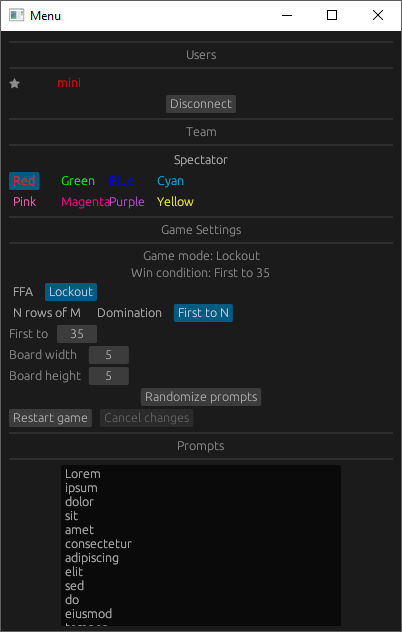
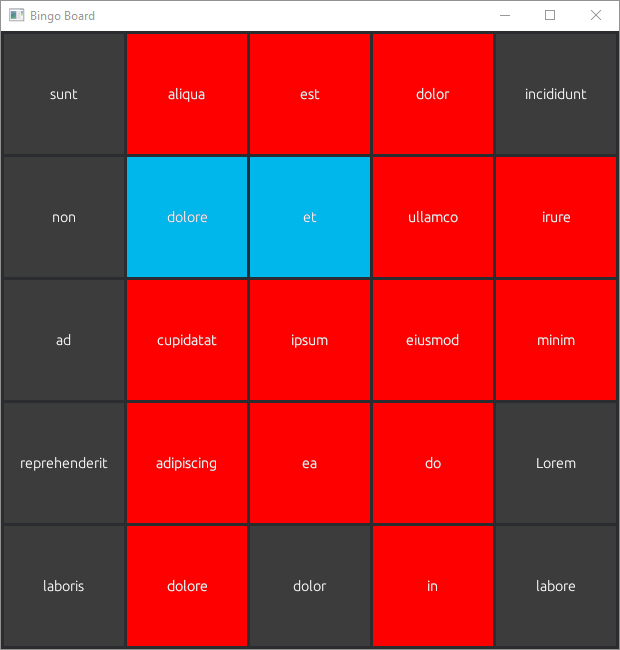

# Bingo

This is a simple bingo app I coded over 3 days in Bevy engine.

It uses a server-client model using the QUIC protocol.

## Server

Launch with
```rs
cargo run --bin bingo-server
```

I'm lazy so server cannot be configured from file.
App listens on all interfaces on port 6000.

## Client

Launch with
```rs
cargo run --bin bingo-client
```

When you open the app, you will be asked to provide a nickname and address (ip + port).

After connecting succesfully you'll be in the game.
It consists of a menu and a game board.




After joining the room you are a spectator, make sure to change teams.

The room owner is whoever joins first, if they leave the migration order is undefined.
As the owner, you can freely modify the game.

| :exclamation:  Pending room changes will prevent you from playing the game until you confirm or cancel them! |
|---|

Client configuration is stored respectively in `userdata.toml` and `prompts.toml`.

After winning a game the `win.ogg` will play, don't get scared like I did 😄
